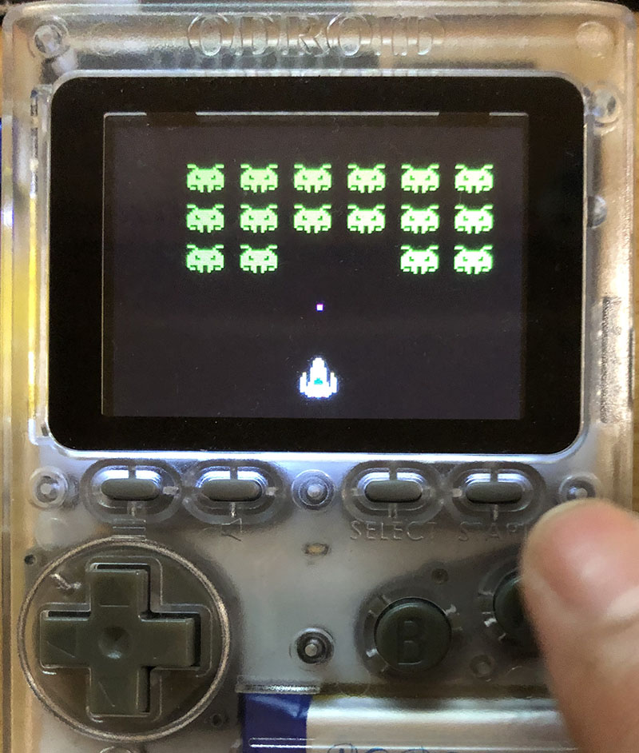

# SpaceShooter for Odroid-GO & M5Stack

 

### Binary files for Launcher
- in M5_Gamebin ... 4M minimal SPIFFS partition scheme.
- in MD_Gamebin ... 4M default partition scheme.
- in MF_Gamebin ... Fire defaut partition scheme.
- in OG_Gamebin ... bin file for Odroid-GO.
- in odroid/firmwares ... fw file for Odroid-GO Menu Control.

### Copy the binary files to microSD

- Copy the files in the microSD folder to the root of microSD.
- Set the microSD into the M5Stack / Odroid-GO
- Select and launche the program with [LovyanLauncher](https://github.com/lovyan03/M5Stack_LovyanLauncher).
- For the original Odroid-GO device firmware menu control, no launcher is needed (see below).

##### ODROID-GO Device Firmware Menu Controls

	1. Power Switch Off
	2. Hold B button, Power Switch On
	3. Release B button when device firmware Menu appears.

	Launch an app
	- A button: Select Application F/W
	- B button: Cancel
	- Start : Write Application F/W

### Modified by Micutil

- Added launcher code for SD-Update / LovyanLauncher.
- Modified code for Odroid-GO ([using ESP32-Chimera-Core](https://github.com/tobozo/ESP32-Chimera-Core)).
- Added binary for Odroid-GO.

### How to play for Odroid-GO version

- Move rocket: Left & Right cross key
- Shoot missile: A or B button.

-------------------------
### Original READ ME

 

 

 

## About

- Space Invaders for the M5Stack.

- Written by Tyler Edwards for the Hackerbox #0020 badge -  https://github.com/HailTheBDFL/

- Ported to the M5Stack by [macsbug](https://macsbug.wordpress.com/2018/01/12/esp32-spaceshooter-with-m5stack/)

 
